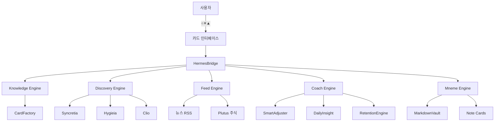
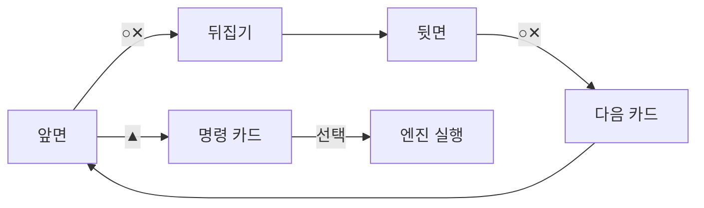
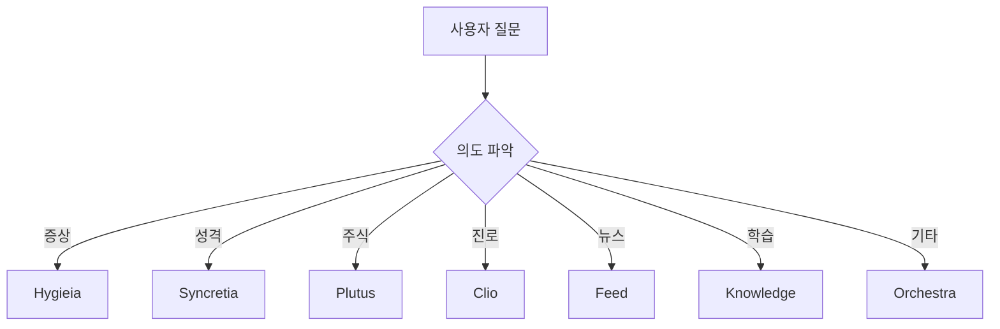

# 🎯 TikiTaka 기획 다이어그램

## 전체 아키텍처

```mermaid
graph TD
    U[사용자] -->|○✕▲| CARD[카드 인터페이스]
    CARD --> HERMES[HermesBridge]
    HERMES --> KNOW[Knowledge Engine]
    HERMES --> DISC[Discovery Engine]
    HERMES --> FEED[Feed Engine]
    HERMES --> COACH[Coach Engine]
    HERMES --> MNEME[Mneme Engine]
    
    DISC --> SYN[Syncretia]
    DISC --> HYG[Hygieia]
    DISC --> CLI[Clio]
    
    FEED --> NEWS[뉴스 RSS]
    FEED --> PLUTUS[Plutus 주식]
    
    COACH --> ADJ[SmartAdjuster]
    COACH --> INS[DailyInsight]
    COACH --> RET[RetentionEngine]
    
    KNOW --> FACT[CardFactory]
    
    MNEME --> VAULT[MarkdownVault]
    MNEME --> NOTE[Note Cards]
```

## 카드 흐름

```mermaid
flowchart LR
    FRONT[앞면] -->|○✕| FLIP[뒤집기]
    FLIP --> BACK[뒷면]
    BACK -->|○✕| NEXT[다음 카드]
    NEXT --> FRONT
    FRONT -->|▲| CMD[명령 카드]
    CMD -->|선택| ENGINE[엔진 실행]
```

## 엔진 라우팅

```mermaid
flowchart TD
    Q[사용자 질문] --> INTENT{의도 파악}
    INTENT -->|증상| HYG[Hygieia]
    INTENT -->|성격| SYN[Syncretia]
    INTENT -->|주식| PLU[Plutus]
    INTENT -->|진로| CLI[Clio]
    INTENT -->|뉴스| FEED[Feed]
    INTENT -->|학습| KNOW[Knowledge]
    INTENT -->|기타| ORCH[Orchestra]
```
